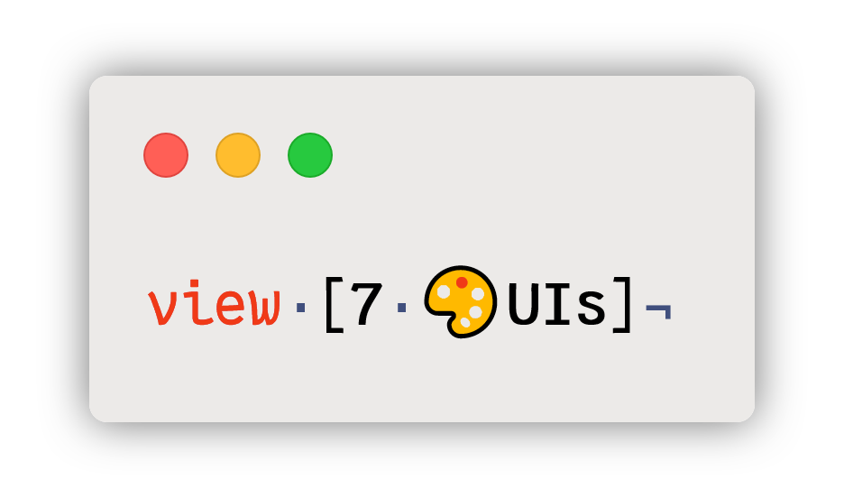

:count:  270
:commit: fe2ad52

ifdef::env-github[]
++++

++++
endif::[]
ifndef::env-github[]

endif::[]

== About

https://eugenkiss.github.io/7guis[7GUIs] benchmark tasks implemented in https://www.red-lang.org[Red] programming language.

This project serves a fourfold purpose:

. Fresh take on all the seven challenges, without peeking into existing solutions;
. Baseline for comparison of Red's approach to GUI programming with other mainstream toolkits;
. Evaluation of https://github.com/red/docs/blob/master/en/vid.adoc[VID dialect] and https://github.com/red/docs/blob/master/en/view.adoc[View engine], search for their potential improvements;
. Testbed for GUI backends supported by View.

Other known implementations:

- https://github.com/greggirwin/7guis/tree/master/Red[Gregg Irwin].

== Status

All seven challenges are complete and clock under {count} lines of code, barring script headers. Original https://eugenkiss.github.io/7guis-React-TypeScript-MobX/[solutions] in React/TypeScript/MobX were used as a reference implementation.

The project was tested on all supported View backends with Red https://github.com/red/red/commit/{commit}[`{commit}`]; the following issues were found:

.Known issues.
[cols=".^1,1,1,5"]
|===
| Backend | Task | Issue | Description

| Win32
| --
| --
| --

.2+| Cocoa
| link:tasks/4.timer.red[Timer]
| #TODO#
| Progress bar is not updated.

// Cocoa
| link:tasks/7.cells.red[Cells]
| #TODO#
| Spreadsheet cells are unresponsive.

| GTK
| link:tasks/5.crud.red[CRUD]
| #TODO#
| Some critical assertions are failing inside the GTK library.

|===

== Structure

link:/tasks/[`tasks/`]:: Solutions to 7GUIs challenges, one file per task.

link:review.adoc[`review`]:: Case-study of the above-mentioned solutions; follows Eugen Kiss' https://github.com/eugenkiss/7guis/blob/master/thesis.pdf[thesis] methodology.

== Setup

NOTE: If you prefer, both GUI console and toolchain can be compiled from https://github.com/red/red#running-red-from-the-sources-for-contributors[sources].

To quickstart, https://www.red-lang.org/p/download.html[download] GUI Red distribution and open the console. From there, you can create a convenient shortcut:

[,red]
----
tasks: https://raw.githubusercontent.com/9214/7guis-red/master/tasks
----

And after that, simply `do` tasks directly from Github. For example:

[,red]
----
do tasks/counter.red
----

For a more hands-on and offline experience, clone this repository to tinker directly with sources. Assuming you're in project's root directory, the example above boils down to:

[,red]
----
do %tasks/counter.red
----

If running interpreter is not enough and you wish to compile instead, download Red toolchain, then switch on encapping with release mode:

[,console]
----
toolchain --encap --release ./tasks/counter.red
----

See `toolchain --help` for details.

== License

The project is released under link:COPYING[3-clause BSD license], same as Red.
